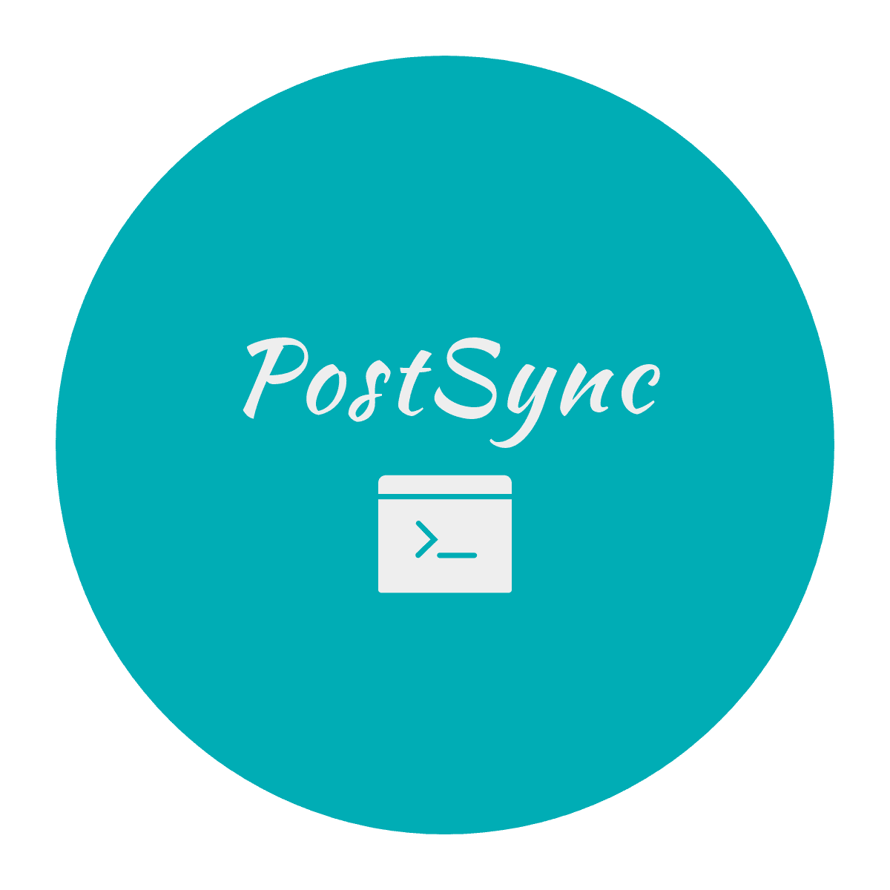

<div align="center">
   
  <h3 align="center"> PostSync </h3> 
  <p align="center"> Promoting the Development of Technical Articles </p> 
</div>

### Introduction

This is an open-source software for synchronizing articles, which allows you to sync your articles to multiple
platforms.

### Usage

1. Open the config.yaml file and configure your browser information, browser user data directory, and executable browser path. 
   ```yaml
    executable:
      path: C:\Program Files (x86)\Microsoft\Edge\Application\msedge.exe # Path to the browser executable
    default:
      browser: msedge # Browser to use (msedge, chrome, firefox)
   ```
   >  You can search online to find the location of the browser data directory.
2. Run the command line. Manually log in to the platform type you need to upload to.   
   The system will automatically detect whether the login is successful.   
   If successful, it will automatically save the login information and close the page.
3. Run the command line again.

### Development

Debug Configuration
Open the config.yaml file and set app/debug to True.

#### Packaging

pyinstaller PostSync.spec
CopyInsert
Then copy config.yaml to the dist/PostSync directory, and run PostSync.exe from the command line.

### Notes

- Ensure you have created the corresponding tags and categories on the relevant platforms if you plan to use tagging and
  categorization features.

### Features

- Automatically sync articles to Juejin, CSDN, Zhihu, WeChat Official Account, Bilibili, CNBlog, and personal WordPress
  platforms, returning the generated article links.
- Support for multi-coroutine, asynchronous uploading of articles.
- Support for inclusion search, case-insensitive fuzzy matching.
- Support for .md and .html files.
- Support for custom default configurations.
- Support for command-line interface.
- Customizable tags, categories, columns, covers, and abstracts.

### Optimization Tasks

- [ ] Use algorithm to optimize the digest and tags of articles.
- [ ] Record the logs of the process.
- [ ] Not input if the arguments are not provided.
- [ ] Direct publishing to WeChat Official Account.
- [ ] Optimize inclusion search to approximate search.

### Development Guidelines

New community classes under the entity package should inherit from the Community class.
The naming of new community classes should be in camelCase.
Code style follows PEP8 standards.
