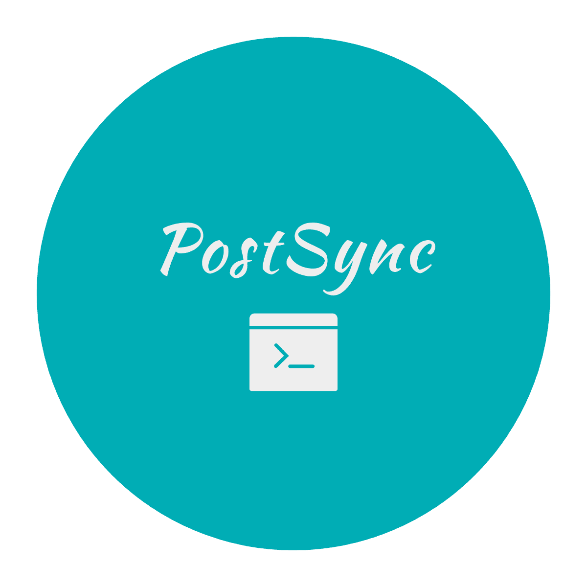

<div align="center">

<h3 align="center">
    PostSync
    </h3>
<p align="center">
        促进技术文章发展
    </p>
</div>

### 介绍📖

PostSync是一款开源的跨平台文章同步工具，可以同步你的文章到多个平台。
一次编写，多处同步，同时上传标签，分类，栏目，封面等参数。  

### 使用🎭

1. 打开PostSyncGUI.exe文件
2. 登录相关平台
3. 配置相关平台的默认参数
4. 选择需要同步的文章上传

#### GUI界面


#### 注意事项

- 使用标签分类等功能请确保您在相关平台上已经创建相应的标签分类

### 开发⛏️

#### 配置debug

打开`config.yaml`文件,将`app/debug`设置为`True`

#### 打包

``` bash
python make.py
```

> 打包时会自动将`config.yaml`中的相关参数设置为产品环境

### 功能📲

- 自动同步文章到掘金、CSDN、知乎、公众号、哔哩哔哩、博客园等平台并返回生成文章链接
- 支持多协程，异步上传文章
- 支持包含查找，大小写模糊匹配
- 支持md,html,docx文件上传，并实现自动转换
- 支持自定义默认配置
- 自定义标题、标签、分类、专栏、封面、摘要等
- 支持插件扩展
- 撰写markdown文章

### 优化任务🕐

- [ ] 完善开发文档
- [ ] 撰写文章图片显示问题
- [ ] 搭配图床接口
- [ ] 记录失败日志
- [ ] 公众号直接发布
- [ ] 包含查找优化为近似查找

### 开发规范📃

- entity包下的新增社区应继承Community类
- 新增社区类的命令应为首字母大写其余字母全部小写
- 代码风格遵循PEP8规范

### 关于作者👨‍💻

作者本人目前就读于中原工学院，是一名超级热爱编程的本科生
喜欢各种运动和各种音乐

- 邮箱：<xiaofengs@yeah.net>
- 网站: <https://xiaofengsoft.github.io>

公众号:


### 打赏💴

如果觉得本软件对您有帮助，不如请我喝杯☕！


### 鸣谢🍻

- 感谢JetBrains公司提供的免费学生许可证
- 感谢FittenCode AI智能代码辅助助手的大力相助
